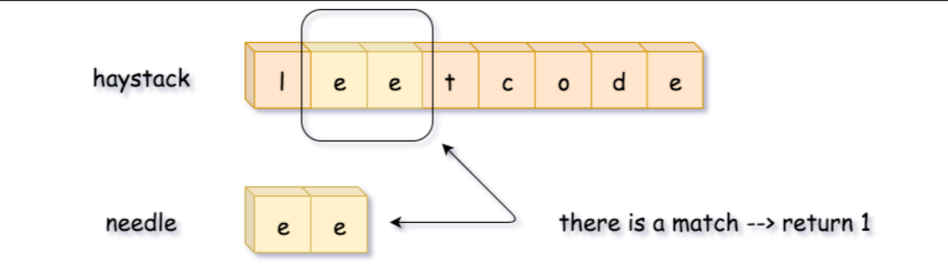
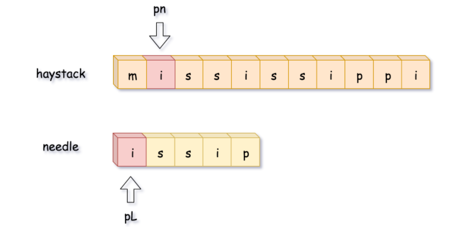

# [28. 实现 strStr()](https://leetcode-cn.com/problems/implement-strstr/)

实现 strStr() 函数。

给定一个 haystack 字符串和一个 needle 字符串，在 haystack 字符串中找出 needle 字符串出现的第一个位置 (从0开始)。如果不存在，则返回  -1。

示例 1:

> 输入: haystack = "hello", needle = "ll"
> 输出: 2

示例 2:

> 输入: haystack = "aaaaa", needle = "bba"
> 输出: -1


## 分析

**方法一：子串逐一比较 - 线性时间复杂度**

最直接的方法 - 沿着字符换逐步移动滑动窗口，将窗口内的子串与 needle 字符串比较。




**方法二：双指针 - 线性时间复杂度**
上一个方法的缺陷是会将 haystack 所有长度为 L 的子串都与 needle 字符串比较，实际上是不需要这么做的。

首先，只有子串的第一个字符跟 needle 字符串第一个字符相同的时候才需要比较。



其次，可以一个字符一个字符比较，一旦不匹配了就立刻终止。      

​        

## 代码

3ms  beats 40 % 

```java
class Solution {
    public int strStr(String haystack, String needle) {
        if (needle.equals(""))return 0;
        int m = haystack.length(), n = needle.length();
        if (m < n) return -1;
        for (int i = 0; i < m; i++) {
            if (haystack.charAt(i)==needle.charAt(0) && m-i>=n){
                boolean flag = true;
                for (int j = 1; j < n; j++) {
                    if (haystack.charAt(i+j)!=needle.charAt(j)){
                        flag = false;
                        break;
                    }
                }
                if (flag==true)return i;
            }
        }
        return -1;
    }
}
```


## 难点


## KMP优化

